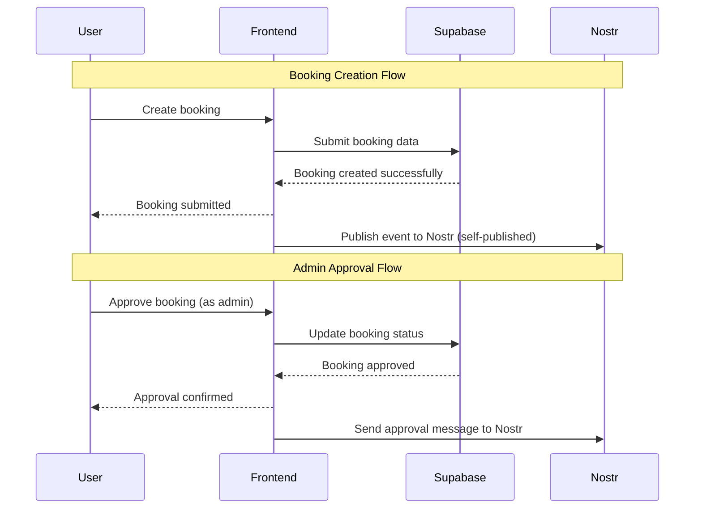
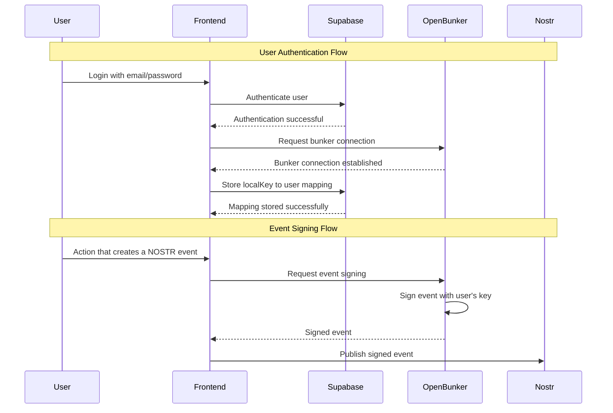
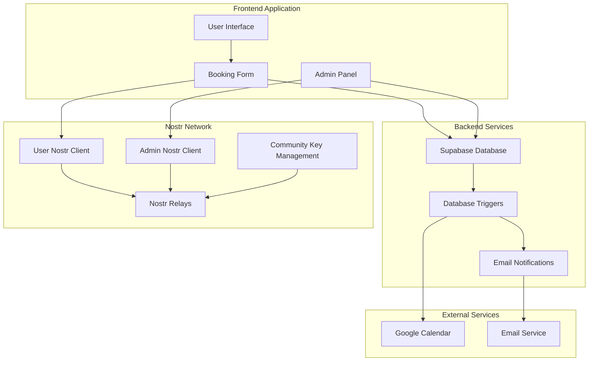
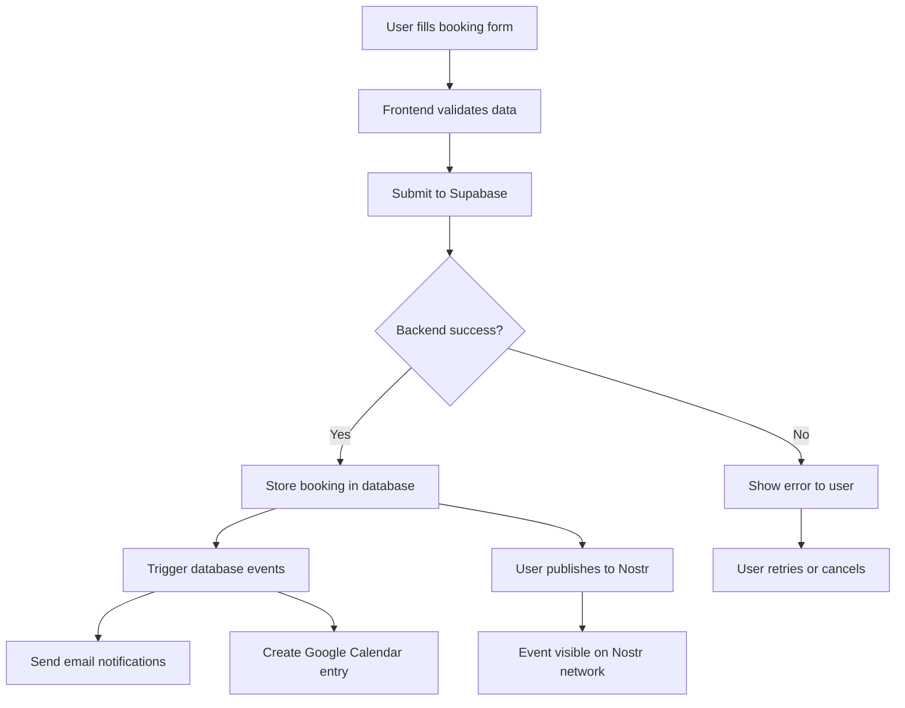
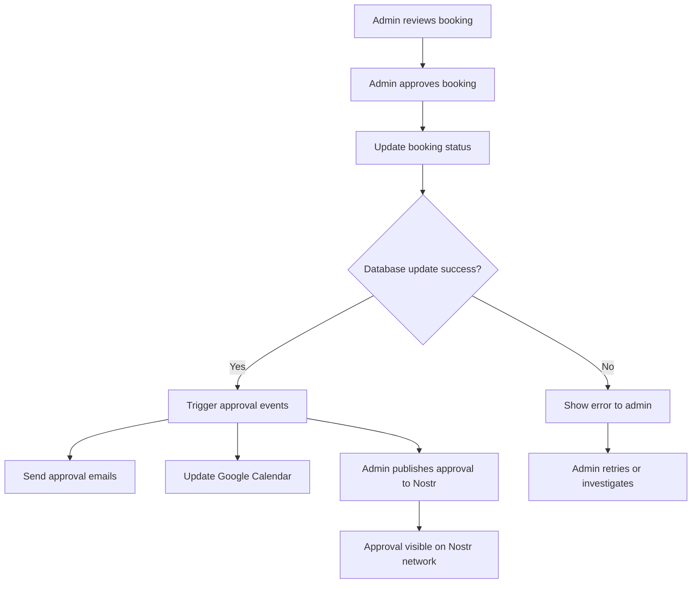
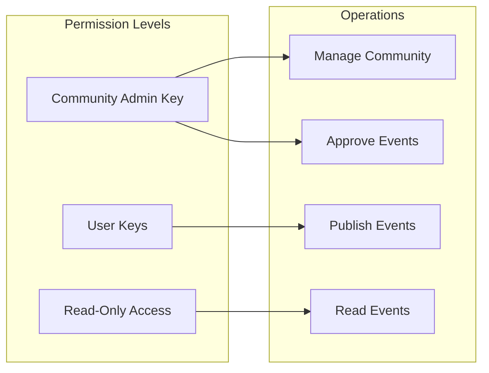

# Nostr Integration for Booking System

## Overview

The booking system introduces a decentralized approach to calendar event management using Nostr (Notes and Other Stuff Transmitted by Relays). This creates a more resilient and censorship-resistant event publishing system while maintaining the existing booking workflow.

## Key Components

1. **Booking System Key**: A dedicated administrator key for the Nostr community that manages permissions
2. **User Self-Publishing**: Users publish their own events to Nostr after successful backend confirmation
3. **Admin Approval Flow**: Admins send approval messages to Nostr after confirming bookings
4. **Community Management**: The system key manages community permissions and access

## Architecture Flow



## Authentication Flow



## Detailed System Architecture



## Data Flow Diagrams

### 1. Booking Creation Process



### 2. Admin Approval Process



## Key Benefits

1. **Decentralization**: Events are published to Nostr network, making them censorship-resistant
2. **User Control**: Users maintain control over their own event publications
3. **Admin Oversight**: Admins can approve and manage events through the community system
4. **Redundancy**: Multiple systems ensure event visibility (Google Calendar + Nostr)
5. **Community Management**: Centralized key management for community permissions

## Implementation Considerations

### 1. Key Management
- Secure storage and rotation of community administrator keys
- Proper key backup and recovery procedures
- Access control for key usage

### 2. User Experience
- Seamless integration of Nostr publishing into existing workflow
- Clear feedback when Nostr publishing succeeds or fails
- Fallback mechanisms for when Nostr is unavailable

### 3. Error Handling
- Graceful fallbacks when Nostr publishing fails
- Retry mechanisms for failed publications
- User notification of publication status

### 4. Privacy
- Consideration of what data is published to public Nostr network
- Optional privacy controls for sensitive event information
- Compliance with data protection regulations

### 5. Relay Selection
- Choosing reliable Nostr relays for event distribution
- Geographic distribution of relays for better availability
- Monitoring relay health and performance

## Security Model



## Technical Implementation

### Current Implementation

The current system in `handleCalendar.ts` already supports Nostr integration:

```typescript
// Current Nostr event creation for confirmed bookings
const calendarEvent: CalendarTimeBasedTemplateEvent = {
  kind: 31923,
  tags: [
    ["a", getCommunityATag(community_id, community_identifier)],
    ["d", Math.random().toString(36).substring(7)], // Random identifier
    ["title", record.title],
    ["start", dateToTimestamp(record.start_time)],
    ["end", dateToTimestamp(record.end_time)],
    ["location", "Commons Hub Brussels"],
    ["location", record.room_name],
  ],
  content: record.description || "",
  created_at: Math.floor(Date.now() / 1000),
};
```

### Proposed Enhancements

1. **User Self-Publishing**: Add Nostr publishing capability to the frontend
2. **Admin Approval Messages**: Implement approval message publishing
3. **Community Management**: Add community permission management
4. **Error Handling**: Improve error handling and retry mechanisms

## Environment Variables

Required environment variables for Nostr integration:

```bash
# Nostr Configuration
NOSTR_SECRET_KEY=your_community_admin_secret_key
NOSTR_COMMUNITY_ID=your_community_id
NOSTR_COMMUNITY_IDENTIFIER=your_community_identifier

# Relay Configuration
NOSTR_RELAYS=wss://relay.chorus.community,wss://relay.damus.io
```

## Future Enhancements

1. **Multi-Relay Support**: Publish to multiple relays for better distribution
2. **Event Updates**: Support for updating and canceling events on Nostr
3. **Community Features**: Advanced community management and moderation
4. **Mobile Support**: Nostr client integration for mobile devices
5. **Analytics**: Track event visibility and engagement on Nostr network

## Conclusion

This new approach provides a robust, decentralized event management system while maintaining the reliability of traditional calendar systems. The combination of centralized booking management with decentralized event publishing offers the best of both worlds - the reliability and user experience of a traditional booking system with the censorship resistance and community features of Nostr.

The implementation can be done incrementally, starting with the current backend Nostr publishing and gradually adding frontend user publishing capabilities and enhanced community management features. 